# Chronos Pomodoro

> Pomodoro timer SPA to manage cycles, breaks, interruptions and session history with custom timers. Built with React + TypeScript + Vite.

[](https://react.dev)
[](https://www.typescriptlang.org)
[](https://vitejs.dev)
[](https://www.i18next.com)
[](https://opensource.org/licenses/MIT)

**Live Demo:** _add your Vercel URL here_ · **Stack:** React 19, React Router 7, Context + useReducer, Web Worker, i18next, date-fns, lucide-react

**🇧🇷 Leia em Português:** [Português](#-português)

---

## Screenshots

| Home | History | Settings | About |
|---|---|---|---|
| 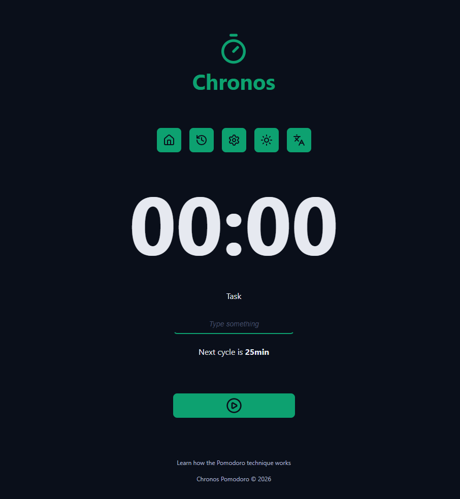 | 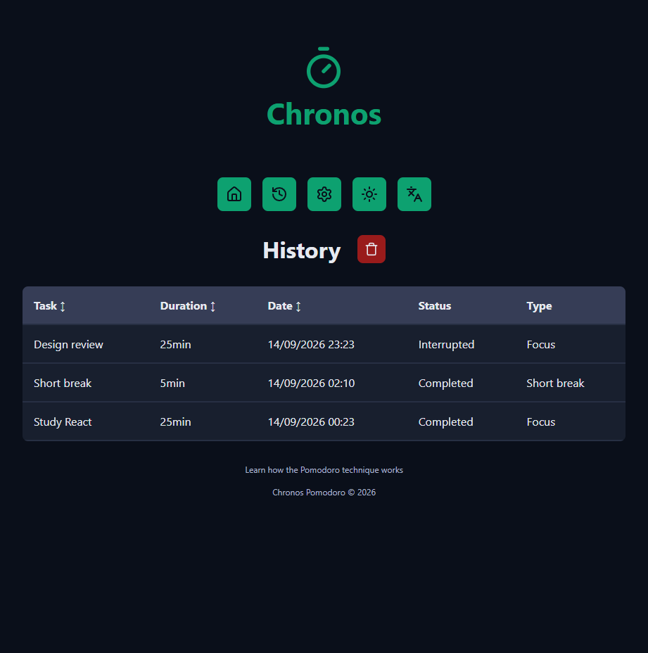 | 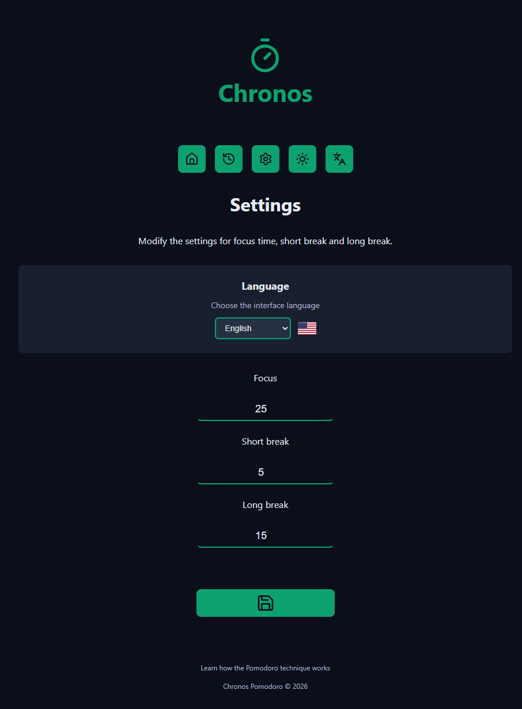 | 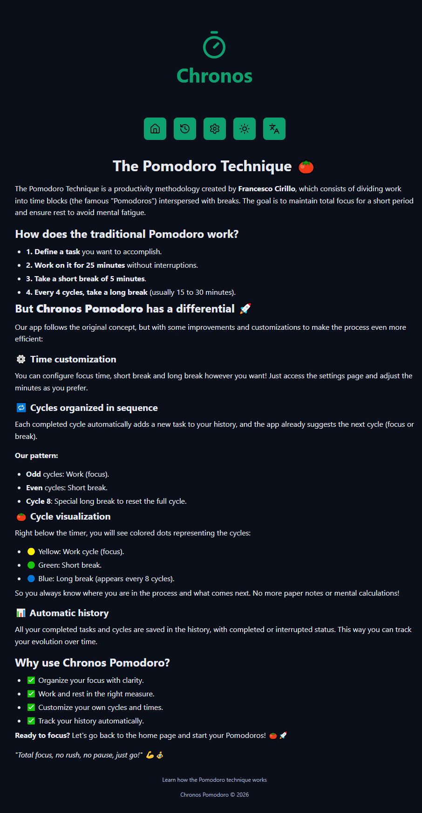 |

| History (empty) | Home (active) | Menu Switcher | Theme Light |
|---|---|---|---|
| 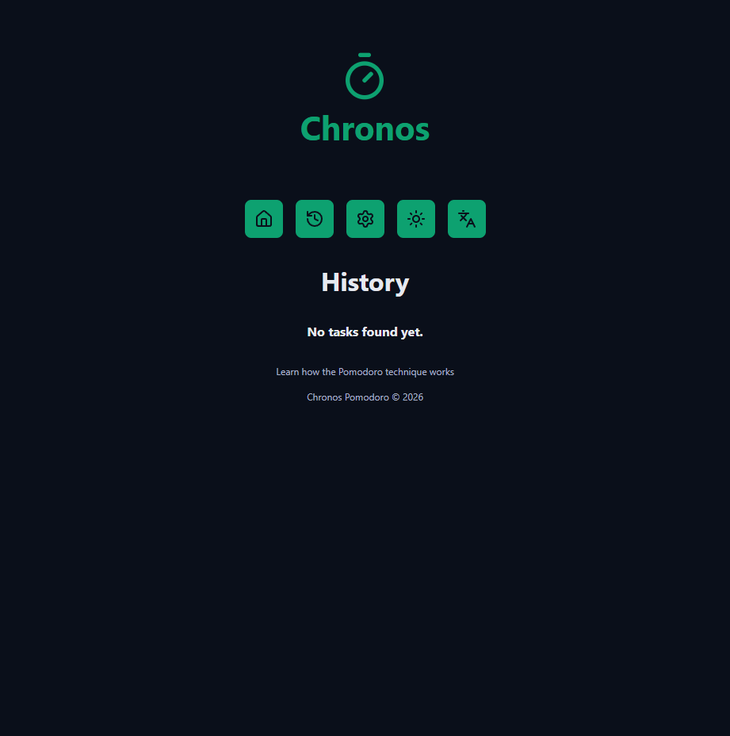 | 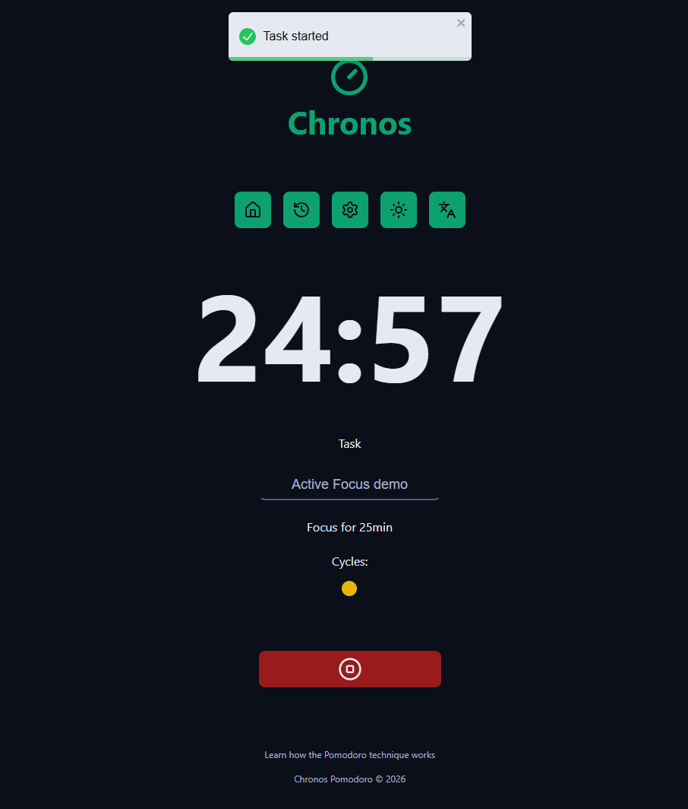 | 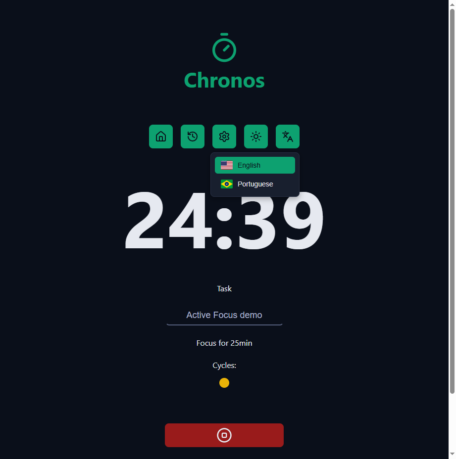 | 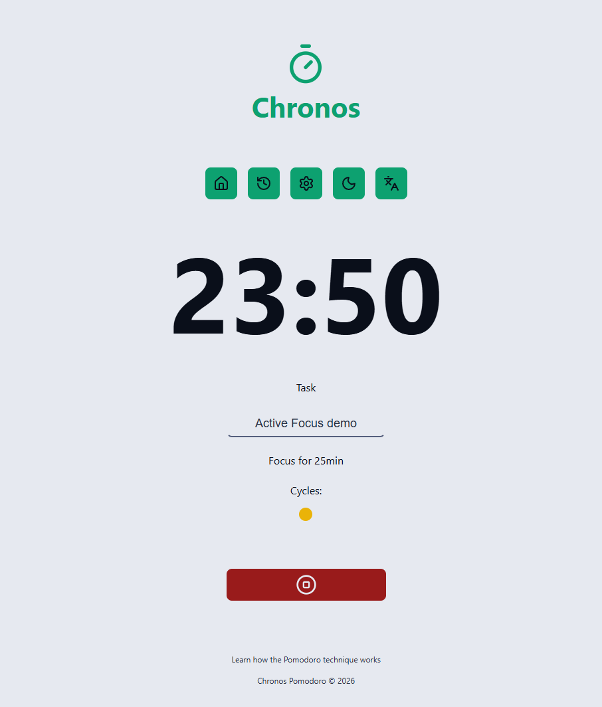 |

> All screenshots are generated from the running app (`npm run dev`). See `screenshots/` for source files.

---

## Features

All features are client-side and persisted in `localStorage`.

- **Managing cycles** — `currentCycle` 0 → 8 loop via `getNextCycle` (`0 || 8 → 1`, else `+1`) and `getNextCycleType` (`%8 → longBreakTime`, `%2 → shortBreakTime`, else `workTime`). Visualized with colored dots in `Cycles`.
- **Breaks** — Short and long break types with contextual `Tips` and cycle indicators. Yellow = focus, green = short break, blue = long break (every 8th cycle).
- **Interruptions** — `INTERRUPT_TASK` sets `interruptDate`, `COMPLETE_TASK` sets `completeDate`. `getTaskStatus` returns `Completed / Interrupted / In Progress / Abandoned` via `i18n.t`.
- **Session history** — `History` page with sortable table (`sortTasks` by name/duration/date), `formatDate`, status and type columns, clear-all with confirm dialog (`Dialog` + `react-toastify`), and empty state.
- **Custom timers** — `Settings` form edits `config: { workTime, shortBreakTime, longBreakTime }` (defaults 25/5/15) with validation `1-99 / 1-30 / 1-60` and `CHANGE_SETTINGS` action.
- **Timer engine** — `TimerWorkerManager` (Web Worker) off the main thread, `formatSecondsToMinutes`, beep on complete via `loadBeep`, and `document.title` countdown.
- **Internationalization** — `i18next` + `i18next-browser-languagedetector` + `react-i18next` with `fallbackLng: en`, `supportedLngs: ["en","pt"]`, resources in `src/locales/en|pt/translation.json`, SVG flags (`br.svg`/`us.svg`), `LanguageSwitcher` dropdown (EN first) in the menu and select in Settings. One-time migration clears legacy `pt` cache to default to English.
- **Theme** — Dark/light toggle via `data-theme` attribute and CSS variables in `theme.css`, persisted in `localStorage`.
- **Routing & UX** — `BrowserRouter` with `/`, `/history/`, `/settings/`, `/about-pomodoro/`, `NotFound`, scroll-to-top, toasts.

---

## Tech Stack

| Layer | Choice | Version |
|---|---|---|
| Framework | React | 19.2.7 |
| Language | TypeScript | 6.0.2 |
| Bundler | Vite | 8.1.1 |
| Routing | react-router-dom | 7.18.3 |
| State | Context + useReducer | — |
| i18n | i18next + detector + react-i18next | 26.4.2 / 8.2.1 / 17.0.14 |
| Dates | date-fns | 4.4.0 |
| Icons | lucide-react | 1.27.0 |
| Notifications | react-toastify | 11.0.5 |
| Lint | eslint + typescript-eslint | 10.6.0 / 8.62.0 |

---

## Architecture Highlights

**State model** — `src/models/TaskStateModel.ts`:
```ts
type TaskStateModel = {
  tasks: TaskModel[];
  secondsRemaining: number;
  formattedSecondsRemaining: string;
  activeTask: TaskModel | null;
  currentCycle: number; // 0..8
  config: { workTime: number; shortBreakTime: number; longBreakTime: number };
}
```

**Reducer** — `src/contexts/TaskContext/taskReducer.ts` handles `START_TASK`, `INTERRUPT_TASK`, `COMPLETE_TASK`, `COUNT_DOWN`, `CHANGE_SETTINGS`, `RESET_STATE`. `TaskContextProvider` hydrates from `localStorage` and syncs on every state change, terminates the worker when idle, and manages the beep lifecycle.

**Worker** — `src/workers/TimerWorkerManager.ts` posts `state` and receives `secondsRemaining` to avoid `setInterval` drift on the main thread.

**i18n** — `src/i18n.ts` uses `LanguageDetector` (`localStorage` → `navigator`), `supportedLngs ["en","pt"]` with `load: "languageOnly"`, `react: { useSuspense: false }`. `LanguageSwitcher` (`src/components/LanguageSwitcher/`) renders a button (`Languages` icon) that opens a listbox with EN (US flag) first, then PT (BR flag).

**Styling** — `src/styles/theme.css` defines CSS variables for both themes, `global.css` for layout, CSS Modules per component, `Container` / `MainTemplate` for page structure.

---

## Project Structure

```
src/
  adapters/        # showMessage (toast wrapper)
  assets/flags/    # br.svg, us.svg
  components/      # Container, CountDown, Cycles, DefaultButton/Input,
                   # Dialog, Footer, Heading, LanguageSwitcher, Logo, Menu, Tips, ...
  contexts/TaskContext/ # TaskContext, Provider, reducer, actions, initialState
  locales/en|pt/   # translation.json
  models/          # TaskModel, TaskStateModel
  pages/           # Home, History, Settings, AboutPomodoro, NotFound
  routers/         # MainRouter (BrowserRouter + Routes)
  styles/          # theme.css, global.css
  templates/       # MainTemplate
  utils/           # getNextCycle, getNextCycleType, sortTasks, formatDate, getTaskStatus, ...
  workers/         # TimerWorkerManager
```

---

## Getting Started

**Prerequisites:** Node.js 18+

```bash
npm install
npm run dev      # http://localhost:5173
npm run build    # tsc -b && vite build
npm run preview  # preview production build
npm run lint     # eslint .
```

No environment variables required. All data is stored in `localStorage` (`state`, `theme`, `i18nextLng`).

---

## Configuration

Default Pomodoro timings in `src/contexts/TaskContext/initialTaskState.ts`:

```ts
config: { workTime: 25, shortBreakTime: 5, longBreakTime: 15 }
```

Edit via **Settings** page (`/settings/`). Validation: work 1-99 min, short 1-30 min, long 1-60 min.

Cycle logic in `src/utils/`:

```ts
getNextCycle(0) // → 1
getNextCycle(8) // → 1 (reset)
getNextCycleType(8) // → "longBreakTime"
getNextCycleType(2) // → "shortBreakTime"
getNextCycleType(1) // → "workTime"
```

---

## Next Steps (Possible Future Improvements)

- Unit tests for `taskReducer`, `getNextCycle` / `getNextCycleType`, `sortTasks` and `formatDate`
- Accessibility audit for `aria-label`/`title` (already translated) and keyboard navigation
- Export history to CSV
- Keyboard shortcuts (Space to start/interrupt)
- Optional sound toggle and volume control for the beep

---

## Author

Built as a learning project (LOM course) and extended with i18n, configurable cycles and persistent history.

**License:** MIT — feel free to fork and adapt.

---

## 🇧🇷 Português

> Cronômetro Pomodoro para gerenciar ciclos, pausas, interrupções e histórico de sessões com timers customizáveis. Feito com React + TypeScript + Vite.

### Screenshots

| Início | Histórico | Configurações | Sobre |
|---|---|---|---|
| 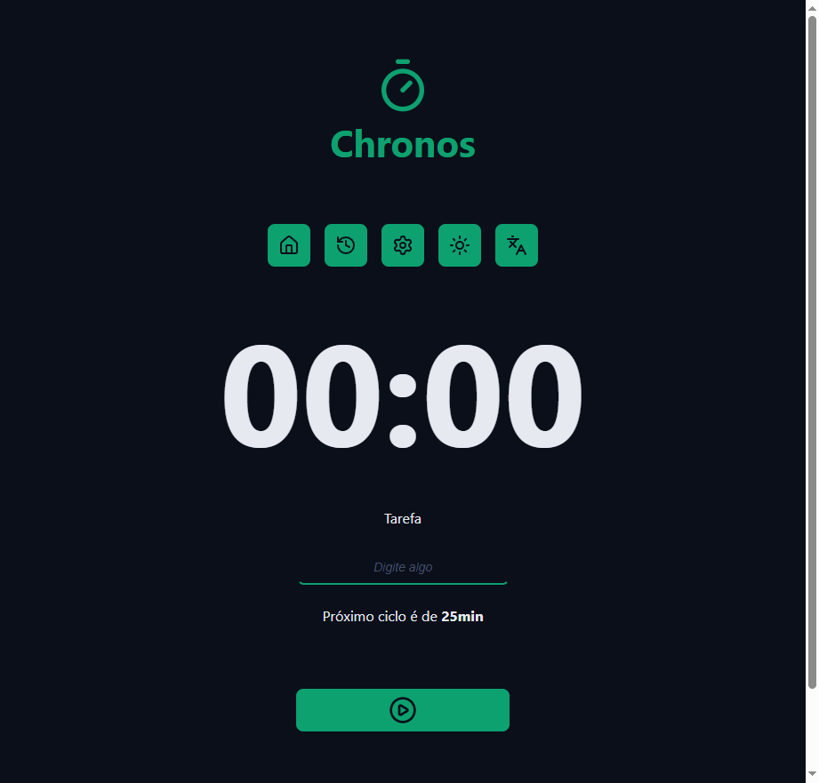 | 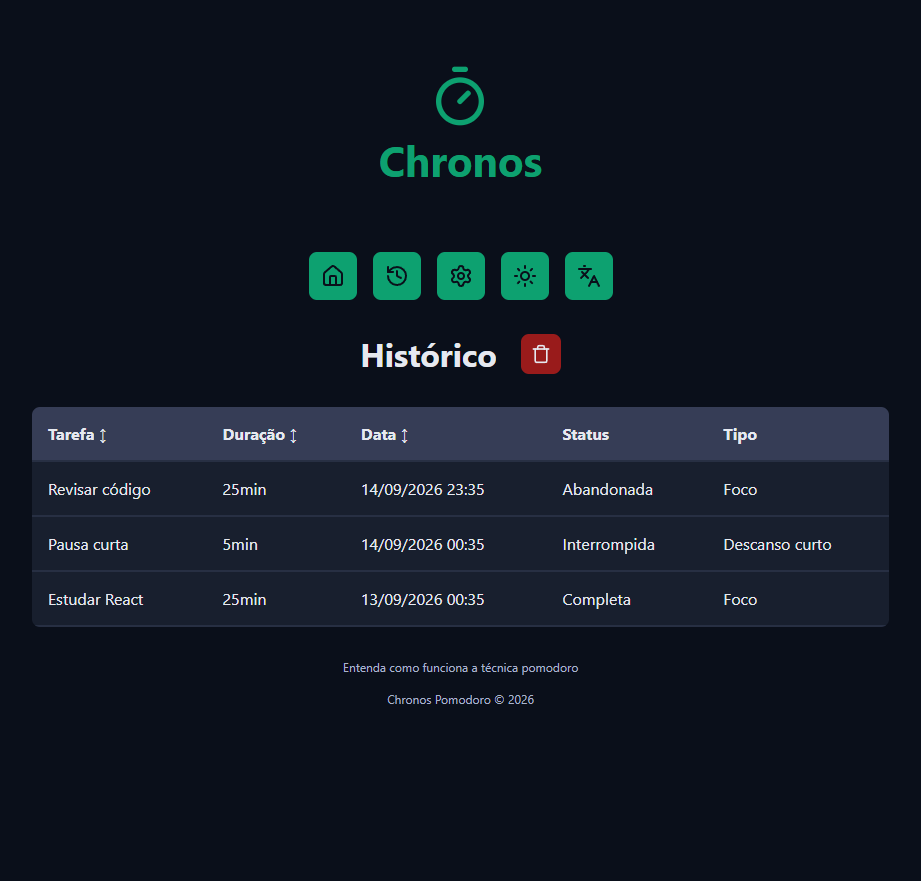 | 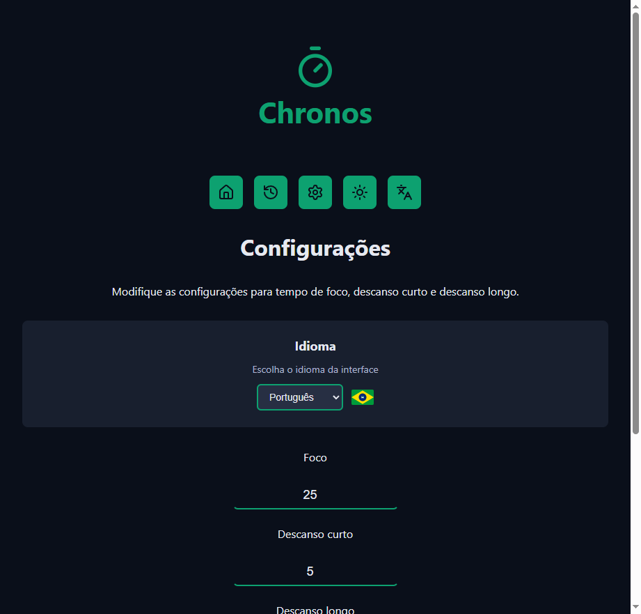 | 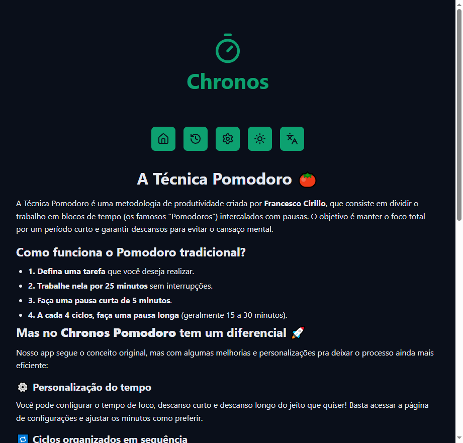 |

| Histórico (vazio) | Início (ativo) | Menu Idioma | Tema Claro |
|---|---|---|---|
| 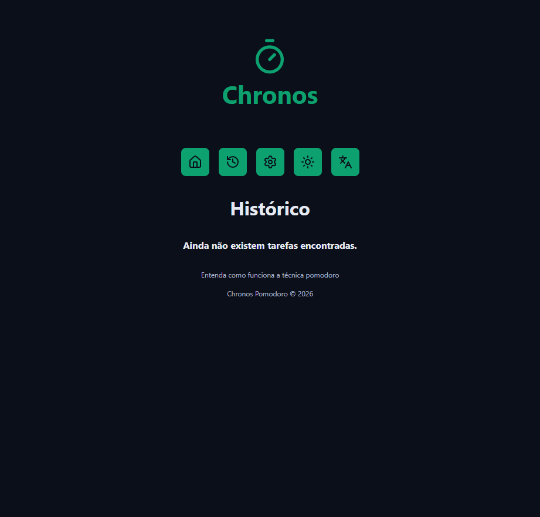 | 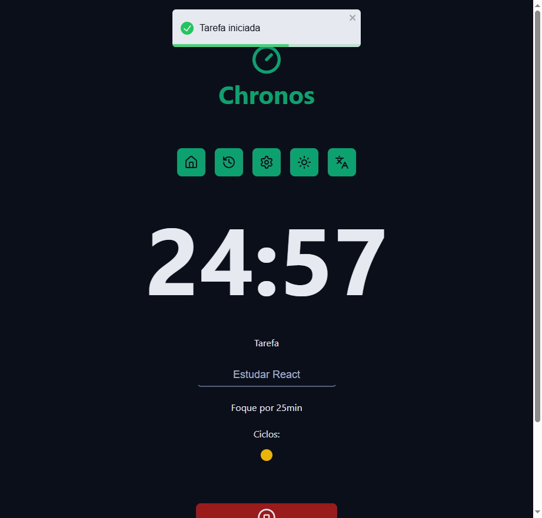 | 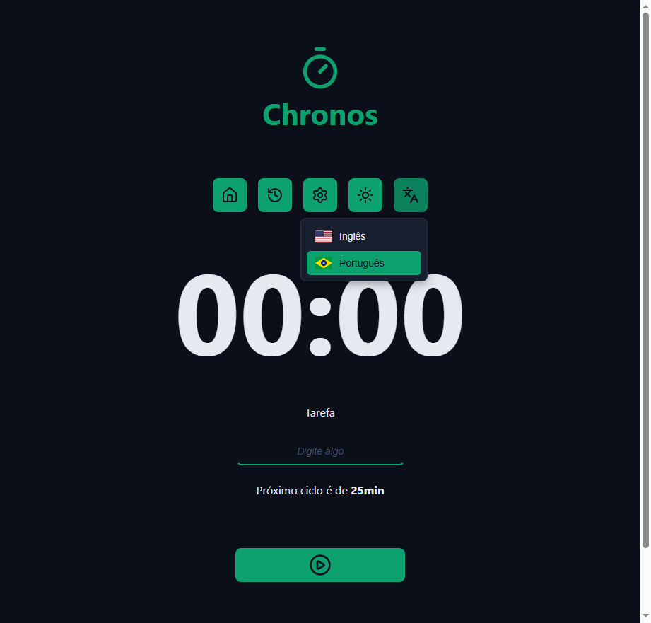 | 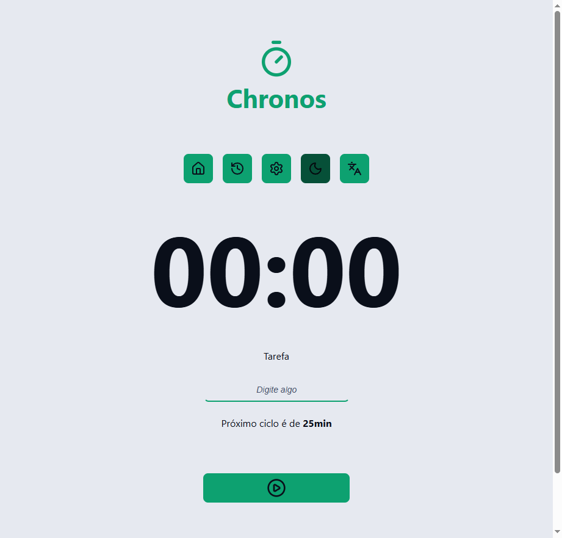 |

> Todos os screenshots são gerados a partir do app em execução (`npm run dev`). Veja `screenshots/` para os arquivos originais.

---

### Funcionalidades

Todas as funcionalidades são client-side e persistidas no `localStorage`.

- **Gerenciando ciclos** — `currentCycle` 0 → 8 em loop via `getNextCycle` (`0 || 8 → 1`, senão `+1`) e `getNextCycleType` (`%8 → longBreakTime`, `%2 → shortBreakTime`, senão `workTime`). Visualizado com bolinhas coloridas em `Cycles`.
- **Pausas** — Tipos de pausa curta e longa com `Tips` contextuais e indicadores de ciclo. Amarelo = foco, verde = pausa curta, azul = pausa longa (a cada 8º ciclo).
- **Interrupções** — `INTERRUPT_TASK` define `interruptDate`, `COMPLETE_TASK` define `completeDate`. `getTaskStatus` retorna `Completa / Interrompida / Em Progresso / Abandonada` via `i18n.t`.
- **Histórico de sessões** — Página `History` com tabela ordenável (`sortTasks` por nome/duração/data), `formatDate`, colunas de status e tipo, limpar tudo com diálogo de confirmação (`Dialog` + `react-toastify`) e estado vazio.
- **Timers customizáveis** — Formulário em `Settings` edita `config: { workTime, shortBreakTime, longBreakTime }` (padrão 25/5/15) com validação `1-99 / 1-30 / 1-60` e ação `CHANGE_SETTINGS`.
- **Motor do timer** — `TimerWorkerManager` (Web Worker) fora da main thread, `formatSecondsToMinutes`, beep ao completar via `loadBeep` e countdown no `document.title`.
- **Internacionalização** — `i18next` + `i18next-browser-languagedetector` + `react-i18next` com `fallbackLng: en`, `supportedLngs: ["en","pt"]`, recursos em `src/locales/en|pt/translation.json`, bandeiras SVG (`br.svg`/`us.svg`), dropdown `LanguageSwitcher` (EN primeiro) no menu e select em Settings. Migração única limpa cache legado `pt` para iniciar em inglês.
- **Tema** — Toggle dark/light via atributo `data-theme` e variáveis CSS em `theme.css`, persistido no `localStorage`.
- **Roteamento & UX** — `BrowserRouter` com `/`, `/history/`, `/settings/`, `/about-pomodoro/`, `NotFound`, scroll-to-top e toasts.

---

### Stack Tecnológica

| Camada | Escolha | Versão |
|---|---|---|
| Framework | React | 19.2.7 |
| Linguagem | TypeScript | 6.0.2 |
| Bundler | Vite | 8.1.1 |
| Roteamento | react-router-dom | 7.18.3 |
| Estado | Context + useReducer | — |
| i18n | i18next + detector + react-i18next | 26.4.2 / 8.2.1 / 17.0.14 |
| Datas | date-fns | 4.4.0 |
| Ícones | lucide-react | 1.27.0 |
| Notificações | react-toastify | 11.0.5 |
| Lint | eslint + typescript-eslint | 10.6.0 / 8.62.0 |

---

### Destaques de Arquitetura

**Modelo de estado** — `src/models/TaskStateModel.ts`:
```ts
type TaskStateModel = {
  tasks: TaskModel[];
  secondsRemaining: number;
  formattedSecondsRemaining: string;
  activeTask: TaskModel | null;
  currentCycle: number; // 0..8
  config: { workTime: number; shortBreakTime: number; longBreakTime: number };
}
```

**Reducer** — `src/contexts/TaskContext/taskReducer.ts` trata `START_TASK`, `INTERRUPT_TASK`, `COMPLETE_TASK`, `COUNT_DOWN`, `CHANGE_SETTINGS`, `RESET_STATE`. O `TaskContextProvider` hidrata do `localStorage` e sincroniza a cada mudança de estado, encerra o worker quando ocioso e gerencia o ciclo do beep.

**Worker** — `src/workers/TimerWorkerManager.ts` envia `state` e recebe `secondsRemaining` para evitar drift de `setInterval` na main thread.

**i18n** — `src/i18n.ts` usa `LanguageDetector` (`localStorage` → `navigator`), `supportedLngs ["en","pt"]` com `load: "languageOnly"`, `react: { useSuspense: false }`. O `LanguageSwitcher` (`src/components/LanguageSwitcher/`) renderiza um botão (ícone `Languages`) que abre um listbox com EN (bandeira US) primeiro, depois PT (bandeira BR).

**Estilização** — `src/styles/theme.css` define variáveis CSS para ambos os temas, `global.css` para layout, CSS Modules por componente, `Container` / `MainTemplate` para estrutura de páginas.

---

### Estrutura do Projeto

```
src/
  adapters/        # showMessage (wrapper do toast)
  assets/flags/    # br.svg, us.svg
  components/      # Container, CountDown, Cycles, DefaultButton/Input,
                   # Dialog, Footer, Heading, LanguageSwitcher, Logo, Menu, Tips, ...
  contexts/TaskContext/ # TaskContext, Provider, reducer, actions, initialState
  locales/en|pt/   # translation.json
  models/          # TaskModel, TaskStateModel
  pages/           # Home, History, Settings, AboutPomodoro, NotFound
  routers/         # MainRouter (BrowserRouter + Routes)
  styles/          # theme.css, global.css
  templates/       # MainTemplate
  utils/           # getNextCycle, getNextCycleType, sortTasks, formatDate, getTaskStatus, ...
  workers/         # TimerWorkerManager
```

---

### Como Começar

**Pré-requisitos:** Node.js 18+

```bash
npm install
npm run dev      # http://localhost:5173
npm run build    # tsc -b && vite build
npm run preview  # preview da build de produção
npm run lint     # eslint .
```

Nenhuma variável de ambiente necessária. Todos os dados ficam no `localStorage` (`state`, `theme`, `i18nextLng`).

---

### Configuração

Timings padrão do Pomodoro em `src/contexts/TaskContext/initialTaskState.ts`:

```ts
config: { workTime: 25, shortBreakTime: 5, longBreakTime: 15 }
```

Edite pela página **Configurações** (`/settings/`). Validação: foco 1-99 min, pausa curta 1-30 min, pausa longa 1-60 min.

Lógica de ciclos em `src/utils/`:

```ts
getNextCycle(0) // → 1
getNextCycle(8) // → 1 (reset)
getNextCycleType(8) // → "longBreakTime"
getNextCycleType(2) // → "shortBreakTime"
getNextCycleType(1) // → "workTime"
```

---

### Próximos Passos (Possíveis Melhorias Futuras)

- Testes unitários para `taskReducer`, `getNextCycle` / `getNextCycleType`, `sortTasks` e `formatDate`
- Auditoria de acessibilidade para `aria-label`/`title` (já traduzidos) e navegação por teclado
- Exportar histórico para CSV
- Atalhos de teclado (Espaço para iniciar/interromper)
- Toggle opcional de som e controle de volume do beep

---

### Autor

Construído como projeto de estudos (curso LOM) e expandido com i18n, ciclos configuráveis e histórico persistente.

**Licença:** MIT — sinta-se à vontade para fazer fork e adaptar.
